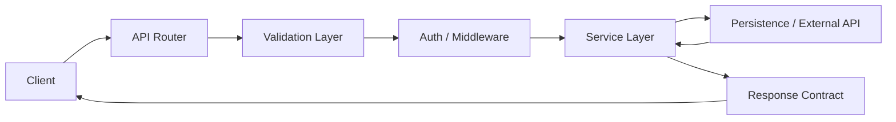
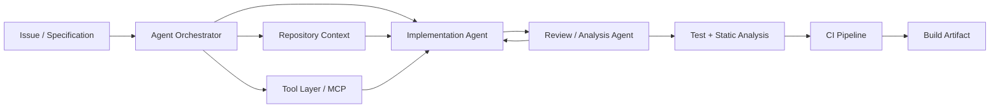
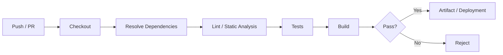

<div align="center">

# Orlando Phillips

### Software Developer


<br><br>

<a href="https://github.com/orlandophillipss">
  
</a>

</div>

---

## Languages

| Language | Use |
| --- | --- |
| **Go** | API services, backend systems, networking and concurrent tooling |
| **C++** | Performance-sensitive software, systems development and native applications |
| **C#** | .NET applications, tooling and game/mod development |
| **Rust** | Memory-safe systems programming and low-level tooling |
| **Lua** | Game scripting, runtime systems and embedded scripting |
| **JavaScript** | APIs, web applications and application logic |
| **HTML / CSS** | Web interfaces and frontend architecture |

---

## Stack

```text
Frontend       React | Next.js | JavaScript | HTML | CSS

Backend        Go | Node.js | API Services | REST | SSR | Service Architecture

Systems        C++ | Rust | C# | Native Applications | Memory / Performance

Game / Mods    Lua | C# | C++ | Runtime Scripting | Game Systems

Automation     GitHub Actions | CI/CD | Build Pipelines | Test Automation

Agent Systems  Agent Orchestration | Tool-Augmented Agents | MCP
               Repository-Aware Agents | Automated Validation
```

---

## Engineering

I work across API development, backend infrastructure, systems programming, web applications, game development and development automation.

My projects tend to involve the architecture behind an application, including API contracts, endpoint design, service boundaries, validation, state persistence, integrations, runtime systems, data flow and developer tooling.

---

## API Engineering

A large part of my backend work is centred around designing and implementing APIs and the systems surrounding them.

```text
API Architecture
RESTful endpoint design
Route composition
Request validation
Response schemas
Serialization / deserialization
Authentication / authorization
Error contracts
Middleware
Service boundaries
State persistence
External API integrations
Client-server data flow
API versioning
Backend abstraction
```

I primarily use **Go** and **Node.js** for API development, depending on the requirements of the service and surrounding stack.

### Typical API Flow



---

## Agent Orchestration

I use agentic workflows as part of the development environment, with agents operating against repositories, tools and validation pipelines rather than treating model output as an isolated code-generation step.



### Workflow Architecture

```text
Specification
    ↓
Context Acquisition
    ├── Repository tree
    ├── Existing implementation
    ├── API surface
    ├── Build configuration
    └── Dependency graph
    ↓
Agent Orchestration
    ├── Planning
    ├── Implementation
    ├── Repository modification
    ├── Tool invocation
    └── Validation
    ↓
Deterministic Verification
    ├── Compiler
    ├── Type checker
    ├── Linter
    ├── Unit / integration tests
    └── Build pipeline
    ↓
CI Gate
    ↓
Merge / Artifact
```

I am interested in workflows where agents can operate over a complete development environment with constrained tool access, repository context and deterministic verification.

This includes:

- Multi-step agent execution over existing codebases
- Repository-aware context acquisition
- Tool-augmented model execution
- MCP-based tool and application integration
- Agent-to-tool orchestration
- Automated repository modification
- Compiler and test feedback loops
- Iterative failure correction
- CI-gated agent output
- Build and deployment automation

---

## CI / CD

I use CI pipelines as a verification boundary between source changes and accepted builds.



Typical pipeline stages include:

```yaml
source:
  - push
  - pull_request

validation:
  - dependency_resolution
  - static_analysis
  - type_checking
  - tests
  - compilation

output:
  - build_artifact
  - release
  - deployment
```

Agent-produced changes still terminate in deterministic engineering checks such as compilation, static analysis, tests and CI validation.

---

## Backend Architecture

I work with backend systems involving:

```text
API routing
Endpoint composition
Middleware chains
Service layers
Request validation
Response contracts
Authentication
Authorization
State persistence
External service integration
Error handling
Concurrency
Client-server architecture
```

Go is one of the main languages I use for backend services because of its concurrency model, standard library and suitability for compact API services and tooling.

---

## Systems Programming

Areas I work with and study include:

```text
Memory layout
Pointers / references
Ownership and lifetimes
Allocation
Data structures
Concurrency
Native compilation
Runtime behaviour
Performance
Operating-system interaction
```

I use C++, Rust and C# depending on the runtime, performance requirements and target environment.

---

## Game Systems & Modding

I also work on game-development and modding projects involving:

```text
Runtime scripting
Physics systems
Input handling
Client / server communication
State synchronisation
Custom UI systems
Persistence
Placement systems
Mod APIs
Game tooling
```

Lua and C# are particularly useful here for scripting and engine/mod integration, with C++ used where native or lower-level behaviour is relevant.

---

## Web

```text
React
Next.js
Node.js
JavaScript
HTML
CSS
Server Components
Client Components
API Routes
SSR
Frontend / API integration
```

I use Next.js and React for full-stack web applications, with APIs and backend services kept as clearly defined application boundaries.

---

## Tooling

<div align="center">


</div>

<br>

<div align="center">


</div>

---

## Technology

<div align="center">


</div>

---

<div align="center">

`github.com/orlandophillipss`

</div>
